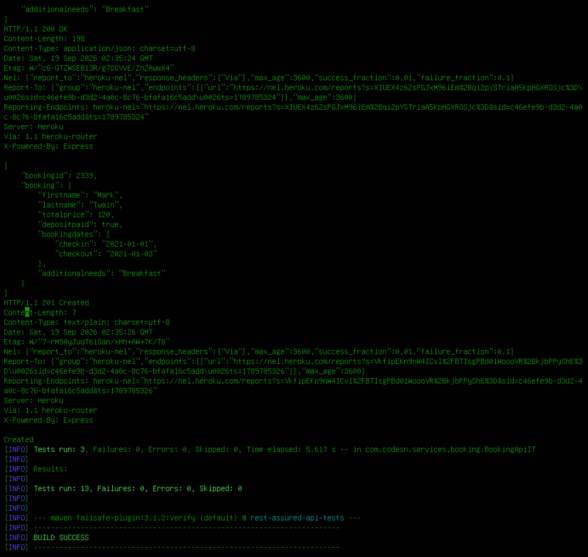
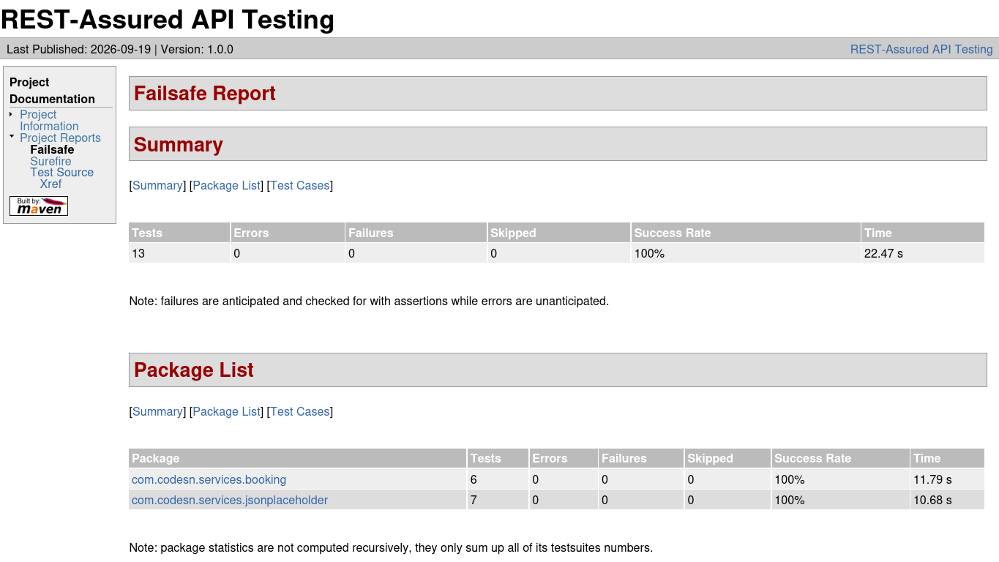

# API Test Framework For Microservices

A modular REST Assured framework for automating API tests across
multiple microservices. Each service plugs in via its
own config file, base class, and payload templates.

<table align="center">
  <tr>
    <td align="center"></td>
    <td align="center"></td>
  </tr>
  <tr>
    <td align="center"><small>Test Run</small></td>
    <td align="center"><small>HTML Report</small></td>
  </tr>
</table>

## Adding a New Service
1. Create `src/test/resources/<service>.config.properties` with `apiBaseUrl`
   and `timeout` (plus auth keys if needed).
2. Add a `<Service>Config.java` that reads it via `ConfigLoader`.
3. Add a `<Service>BaseApi.java` extending `BaseApi` to build the request spec.
4. Add payload templates under `datatemplates/`.
5. Write tests as `*IT.java` classes.

## Running
mvn verify      # runs *IT.java (Failsafe) + verify

Reports: target/site/surefire-report.html after `mvn site`

## Notes
- Tests target public demo APIs (JSONPlaceholder, Restful Booker).
