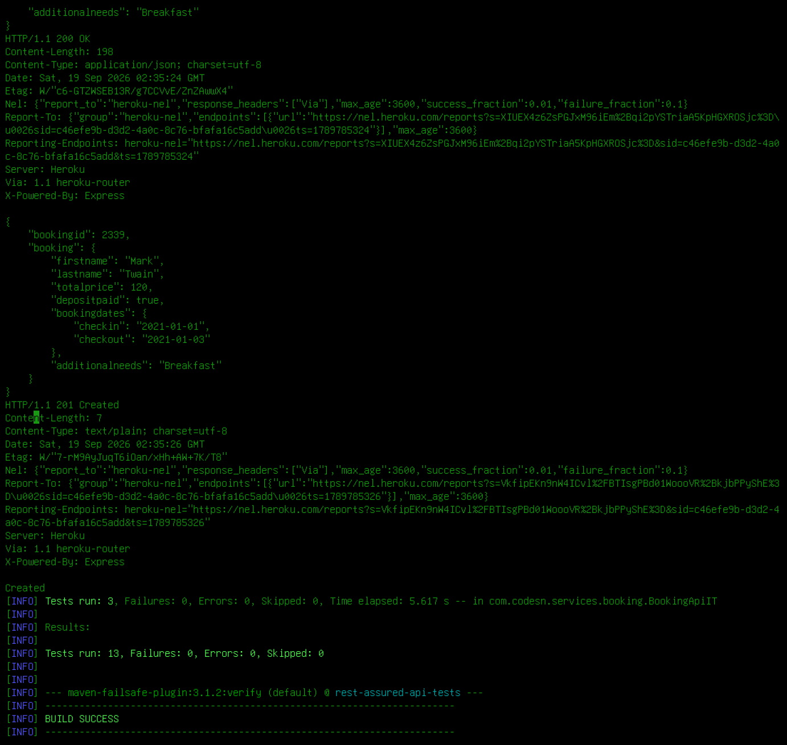
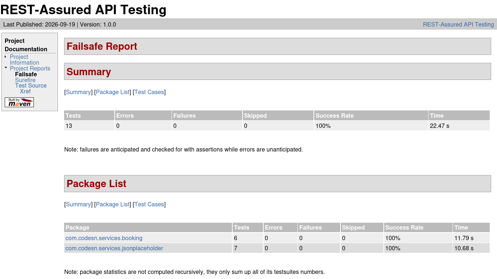

# API Test Framework For Microservices

A modular REST Assured framework for automating API tests across
multiple microservices. Each service plugs in via its
own config file, base class, and payload templates.

<table align="center">
  <tr>
    <td align="center"></td>
    <td align="center"></td>
  </tr>
  <tr>
    <td align="center"><small>Test Run</small></td>
    <td align="center"><small>HTML Report</small></td>
  </tr>
</table>

## Adding a New Service
1. Create `src/test/resources/<service>.config.properties` with `apiBaseUrl`
   and `timeout` (plus auth keys if needed).
2. Add a `<Service>Config.java` that reads it via `ConfigLoader`.
3. Add a `<Service>BaseApi.java` extending `BaseApi` to build the request spec.
4. Add payload templates under `datatemplates/`.
5. Write tests as `*IT.java` classes.

## Running
mvn verify      # runs *IT.java (Failsafe) + verify

Reports: target/site/surefire-report.html after `mvn site`

## Notes
- Tests target public demo APIs (JSONPlaceholder, Restful Booker).

## Project Layout

com.codesn
│
├── core/                              ← framework plumbing (service-agnostic)
│   ├── BaseApi                        (abstract: buildSpec, auth spec helpers)
│   ├── ConfigLoader                   (<svc>.config.properties → Properties)
│   └── utils/
│       ├── WaitForService             (readiness polling)
│       └── TestLogger                 (pretty JSON / Response logging)
│
└── services/                          ← per-microservice plug-ins
    │
    ├── booking/
    │   ├── BookingBaseApi             (extends core.BaseApi)
    │   ├── BookingConfig              (wraps ConfigLoader("booking"))
    │   ├── BookingApiIT               ← test class
    │   └── datatemplates/
    │       ├── BookingPayload
    │       ├── BookingDatesPayload
    │       ├── BookingResponse
    │       └── AuthPayload
    │
    └── jsonplaceholder/
        ├── JsonPlaceholderBaseApi     (extends core.BaseApi)
        ├── JsonPlaceholderConfig      (wraps ConfigLoader("jsonplaceholder"))
        ├── UserApiTestIT              ← test class
        └── datatemplates/
            └── UserPayload

src/test/resources/
├── booking.config.properties
└── jsonplaceholder.config.properties

## UML class diagram

                            ┌─────────────────────────────┐
                            │      <<abstract>>           │
                            │      core.BaseApi           │
                            │─────────────────────────────│
                            │ + @BeforeAll globalSetup()  │
                            │ # buildSpec(uri, timeout)   │
                            │ # specWithAuthBearer(..)    │
                            │ # specWithAuthCookie(..)    │
                            └──────────────┬──────────────┘
                                           │ extends
                          ┌────────────────┴────────────────┐
                          │                                 │
                          ▼                                 ▼
        ┌───────────────────────────────┐   ┌───────────────────────────────┐
        │  <<abstract>>                 │   │  <<abstract>>                 │
        │  BookingBaseApi               │   │  JsonPlaceholderBaseApi       │
        │───────────────────────────────│   │───────────────────────────────│
        │ # REQUEST_SPEC                │   │ # REQUEST_SPEC                │
        │ + @BeforeAll setupBooking()   │   │ + @BeforeAll setupJson…()     │
        │ # specWithAuth()              │   │                               │
        └──────────────┬────────────────┘   └───────────────┬───────────────┘
                       │ extends                            │ extends
                       ▼                                    ▼
        ┌───────────────────────────────┐   ┌───────────────────────────────┐
        │  BookingApiIT                 │   │  UserApiTestIT                │
        │  (test class)                 │   │  (test class)                 │
        └───────────────┬───────────────┘   └───────────────┬───────────────┘
                        │ uses                              │ uses
                        ▼                                   ▼
        ┌───────────────────────────────┐   ┌───────────────────────────────┐
        │  booking.datatemplates        │   │  jsonplaceholder.datatemplates│
        │  ┌─────────────────────────┐  │   │  ┌─────────────────────────┐  │
        │  │ BookingPayload          │  │   │  │ UserPayload             │  │
        │  │ BookingDatesPayload     │  │   │  └─────────────────────────┘  │
        │  │ BookingResponse         │  │   │                               │
        │  │ AuthPayload             │  │   │                               │
        │  └─────────────────────────┘  │   │                               │
        └───────────────────────────────┘   └───────────────────────────────┘
                        │                                   │
                        └───────────────┬───────────────────┘
                                        ▼
        ┌───────────────────────────────────────────────────────────────┐
        │  External SUT                                                 │
        │  • restful-booker.herokuapp.com      (Booking)                │
        │  • jsonplaceholder.typicode.com      (JSONPlaceholder)        │
        └───────────────────────────────────────────────────────────────┘

## Test Execution Flow (Sequence)

### Booking service — auth + CRUD (BookingApiIT)

mvn -B verify  ──►  Failsafe  ──►  BookingApiIT extends BookingBaseApi
   │
   ├─ @BeforeAll setupBooking()
   │     ├─► WaitForService.waitUntilAvailable(BookingConfig.getApiBaseUrl(), 20)
   │     │      └─► poll GET https://restful-booker.herokuapp.com until 200
   │     └─► REQUEST_SPEC = buildSpec(baseUri, timeout)   [JSON + timeouts]
   │
   ├─ @Test getBookingIdsReturns200()
   │     └─► given().spec(REQUEST_SPEC).get()
   │            └─► .then().statusCode(200)
   │
   ├─ @Test postBooking()
   │     ├─► new BookingDatesPayload(...) + new BookingPayload(...)
   │     └─► given().spec(REQUEST_SPEC).body(payload).post("/booking")
   │            └─► .then().statusCode(200)
   │                       .body("bookingid", notNullValue())
   │
   └─ @Test deleteBooking()
         ├─► POST /booking  → extract bookingid
         ├─► specWithAuth()
         │     └─► lazy getToken()
         │           ├─► AuthPayload from BookingConfig creds
         │           ├─► POST /auth  → TestLogger.log
         │           └─► extract token  (cached for subsequent tests)
         ├─► DELETE /booking/{id}  (Cookie: token=…)
         └─► .then().statusCode(201)
         

### JSONPlaceholder service — CRUD, query params, headers (UserApiTestIT)

mvn -B verify  ──►  Failsafe  ──►  UserApiTestIT extends JsonPlaceholderBaseApi
   │
   ├─ @BeforeAll setupJsonPlaceholder()
   │     ├─► WaitForService.waitUntilAvailable(JsonPlaceholderConfig.getApiBaseUrl())
   │     │      └─► poll GET https://jsonplaceholder.typicode.com until 200
   │     └─► REQUEST_SPEC = buildSpec(baseUri, timeout)   [JSON + timeouts]
   │
   ├─ @Test loggerPrintsPayload()
   │     └─► TestLogger.log("Smoke Test", (...))
   │
   ├─ @Test testGetUserById()                       [@Tag SLO]
   │     └─► given().spec(REQUEST_SPEC).get("/users/1")
   │            └─► .then().statusCode(200)
   │                       .body("id", equalTo(...))
   │                       .body("name", equalTo(...))
   │                       .body("email", containsString(...))
   │
   ├─ @Test testCreateUser()
   │     ├─► new UserPayload(...)
   │     └─► given().spec(REQUEST_SPEC).body(requestBody).post("/users")
   │            └─► .then().statusCode(201)
   │                       .body("name", equalTo(...))
   │                       .body("id", notNullValue())
   │
   ├─ @Test testUpdateUser()
   │     ├─► new UserPayload(...)
   │     └─► given().spec(REQUEST_SPEC).body(updateBody).put("/users/1")
   │            └─► .then().statusCode(200)
   │                       .body("name", equalTo(...))
   │
   ├─ @Test testDeleteUser()
   │     └─► given().spec(REQUEST_SPEC).delete("/users/1")
   │            └─► .then().statusCode(200)
   │
   ├─ @Test testGetUserWithQueryParameter()
   │     └─► given().spec(REQUEST_SPEC).queryParam("userId", (...))
   │            .when().get("/posts")
   │            .then().statusCode(200)
   │                   .body("size()", greaterThan(0))
   │                   .body("[0].userId", equalTo(...))
   │
   └─ @Test testWithCustomHeader()
         └─► given().spec(REQUEST_SPEC)
                    .header("X-Custom-Header", (...))
                    .when().get("/users/1")
                    .then().statusCode(200)

